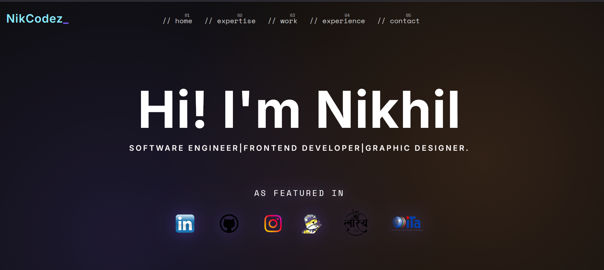

<<<<<<< HEAD
# Portfolio Recreation

This project is a recreation of tamalsen.dev to improve my frontend skills.

## 🚀 Features
- Responsive design
- Smooth animations
- Modern UI/UX

## 🛠 Tech Stack
- HTML
- CSS
- JavaScript

## 📸 Preview

  

## 💡 Learnings
- Improved CSS positioning
- Learned responsive units (vh, vw, rem)

## ⚠️ Challenges
- Aligning elements like original design
- Matching animations exactly

## 📌 Status
Work in progress...
=======
# portfolio-recreation
Recreating tamalsen.dev portfolio using HTML, CSS, and JavaScript for learning and practice.
>>>>>>> e2a56c3eeefab2e6366269d68971d82f61a47426
